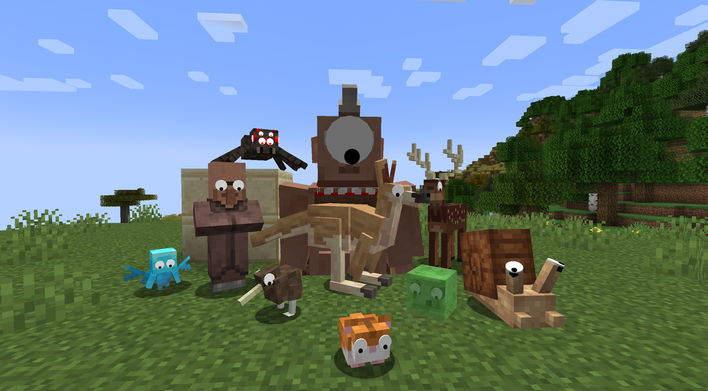

# Some Googly Eyes

A complete rewrite and expansion of iChun's immortal Googly Eyes. Also look to **Regoogly eyes** by EmeryTheModder if you want a pure port of the original.

Now with multiple behaviors: mobs blink, stare, go cross-eyed, side-eye you, and more.

Eyes are a collectible resource: harvest them, recolor them, brew them into a potion, and put them on other mobs, or yourself.

Also compatible with GeckoLib- and Citadel-based mobs, as well as those using legacy LLibrary. Datapack-aware. In-game configuration tool for adding and configuring eyes.

<!-- TODO: hero GIF or short mp4 clip here — a mob with wobbling eyes sells the whole mod in 5 seconds.
     GitHub plays small mp4/mov files (~10 MB) inline if you drag them into the README editor. -->

<!-- TODO: optional YouTube how-to link, as a clickable thumbnail:

-->

## Getting eyes

**Dispatch the mob with a direct shears blow**: there's a chance to drop a googly eye.

**Find the Optometrist enchantment**: Put it on shears; then right-clicking an eyed mob plucks the eye off without harming the mob.

**Customize it in a crafting grid**: eye + any dye sets the iris color, + glowstone dust makes it visible in darkness, + redstone turns glow off, + cobweb strips it back to default.

**Brew it**: awkward potion + googly eye → a drinkable **Googly Eyes** potion. The potion inherits the eye's colors.

**Apply it**: drink it to grow your own googly eyes, or throw the splash to give eyes to one lucky mob nearby.

## Eye potential
Acquire and eye item, sneak while targetting a mod to see <an indicator that the mob has eyes defined, does not yet exist>.

## Configuration

- **Server settings** (`<world>/serverconfig/somegoogly-server.toml`): global and per-mob spawn chances, harvest chance, and which eye expressions play and how often.
- **Client settings** (`config/somegoogly-client.toml`): turn eye rendering off entirely, or hide it for specific mobs or whole mods; purely visual, per-player.

See [docs/configuration.md](docs/configuration.md) for the full reference.

## Pack and mod authors

Eye placements are ordinary datapack JSON. There's also an in-game authoring tool that lets you place, aim, and scale eyes on a live mob in creative mode and export the result as datapack files.

- [docs/datapack-format.md](docs/datapack-format.md) — the eye definition format
- [docs/picker.md](docs/picker.md) — the in-game authoring workflow and `/sg` commands

## Compatibility

Eye placing system works with vanilla models as well as GeckoLib- and Citadel-based models, including those that use legacy LLibarary code.

Mods with predefined eye config:

- Minecraft
- Alex's Mobs
- Ars Nouveau
- Autumnity
- Exotic Birds
- Hamsters
- Ice and Fire
- Immersive Engineering
- Simply Cats
- Twilight Forest

Use the in-game eye config system to generate custom datapacks. Submissions for future releases appreciated! Find a mob that doesn't behave? [Open an issue](../../issues).

## Status

Currently in **alpha release**. It works for me, single and multi-player. But that's all I can say for sure. Buyer beware. Found a bug? [Open an issue](../../issues).

**Fabric, 1.21**: Only after 1.20.1/Forge is known to be stable.

## Credits and license

A port of iChun's **Googly Eyes**, rebuilt for 1.20.1 with new physics, behaviors, and more.

License: **GPL-3.0** — see [LICENSE](LICENSE).
